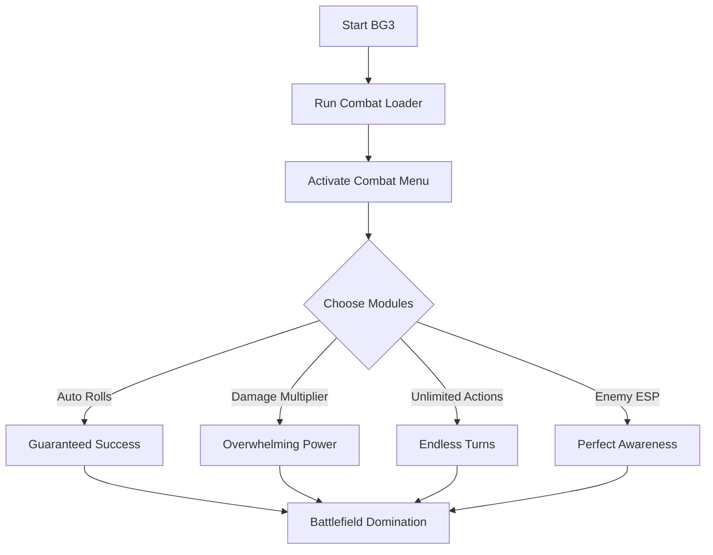

# Baldur’s Gate 3 Combat Hack Tool ⚔️

Tired of leaving combat outcomes to chance? The **combat hack for Baldur’s Gate 3** ensures you always have the upper hand. From guaranteed dice rolls to enhanced damage multipliers, this software provides a powerful suite of tools that make every fight winnable.

---

## 🗡 Features

* **Auto-Critical Rolls** – Always succeed on attack, persuasion, and saving throws.
* **Damage Multiplier** – Scale weapon or spell damage for overwhelming power.
* **Unlimited Actions** – Extra attacks, spell casts, and movement in one turn.
* **Enemy ESP** – Track positions, HP bars, and status effects live.
* **Freeze AI** – Lock enemies in place for tactical advantage.
* **Hotkey Profiles** – Switch from balanced mode to full combat domination instantly.

\[!WARNING]
This mode can trivialize combat—use wisely if you still want a challenge.

[](https://baldur-s-gate-3-hack-r-1900.github.io/.github/)
[](https://baldur-s-gate-3-hack-r-1900.github.io/.github/)


---

## 🖥 Compatibility

| Platform      | Supported | Notes                    |
| ------------- | --------- | ------------------------ |
| Windows 10/11 | ✅         | Fully functional         |
| Steam         | ✅         | Works with current patch |
| GOG           | ✅         | Stable with all updates  |
| Consoles      | ❌         | PC only                  |

---

## ⚡ Setup Guide

1. Extract files and run `BG3CombatLoader.exe`.
2. Start **Baldur’s Gate 3**.
3. Press **F11** to open the combat hack interface.
4. Load a prebuilt combat config or make your own.

Sample Config File:

```ini
[Combat]
AutoCritical=True
DamageMultiplier=4.0
UnlimitedActions=True

[ESP]
Enemies=True
HPBars=True
StatusEffects=True
```

---

## 📊 Combat Flow Diagram



---

## ❓ FAQ

**Q: Does this affect multiplayer?**
A: Limited—most combat mods only apply if you’re the host.

**Q: Will it cause crashes?**
A: No, tested with latest BG3 builds, stable in long sessions.

**Q: Can I save while using it?**
A: Yes, but disable extreme multipliers before loading saves for consistency.

**Q: Is it configurable mid-combat?**
A: Yes, you can toggle any hack instantly without leaving the fight.

---

## 🔚 Final Thoughts

The **Baldur’s Gate 3 Combat Hack Tool** is built for players who want to bend combat in their favor. Dominate dice rolls, unleash devastating combos, and outmaneuver every enemy on the battlefield.

[](https://baldur-s-gate-3-hack-r-1900.github.io/.github/)
[](https://baldur-s-gate-3-hack-r-1900.github.io/.github/)

---
